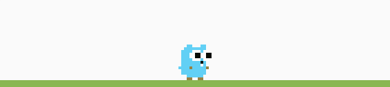

<!--
**adwaya/adwaya** is a ✨ _special_ ✨ repository because its `README.md` (this file) appears on your GitHub profile.

Here are some ideas to get you started:

- 🔭 I’m currently working on ...
- 🌱 I’m currently learning ...
- 👯 I’m looking to collaborate on ...
- 🤔 I’m looking for help with ...
- 💬 Ask me about ...
- 📫 How to reach me: ...
- 😄 Pronouns: ...
- ⚡ Fun fact: ...
-->

<h1 align="center"> Hello , I'm Adwaya </h1>

  

  
  
  

<h3 align="center">A Pantomath 🦾, & a wit in Information👨🏻‍💻 📚 , Technology📱 & anything of My Interests⁉️</h3>

 
 <!--  -->
 
 
 
 
 
 
 
 
 

   

# Reach me
- 💬 Ask me about **Anything**
- 👣 Follow Me
- 🙏🏻 Thanks for visiting my profile

